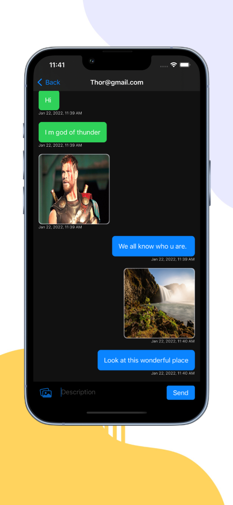

# Flash Chatt

Flash Chatt is an iOS Messaging App which allows to users to send texts and images. It is beautifully designed app with great UI which makes it very user friendly. 
The app is completely built on SwiftUI framework which uses Firebase for authentication and storage of user chats. 

## Screenshots:

  
  
  
  
  

## Installation:
- Download Xcode from AppStore on Mac. 
- Clone this repository(or download zip). 
- Open the FlashChatt.xcodeproj file using Xcode
- Set the Active Scheme to "CoviScan" and Simulator device to "iPhone 13"
- Run the project.
